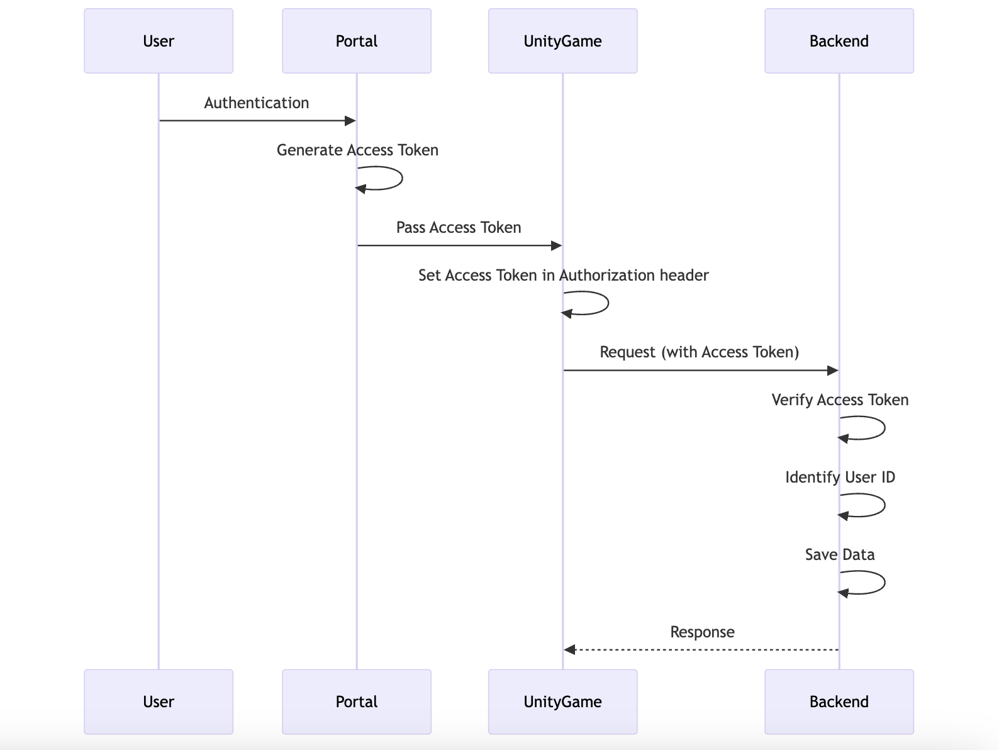

# Windfall

## Technology Used

### Portal

- Next.js, React, Tailwind CSS, shadcn/ui
- Portal is DB less architecture to work with game side easily

### Game

- Unity, AWS

### Solana Contracts

- Light Protocol (ZK Compression)
- MagicBlock Ephemeral Rollups
- Metaplex Core NFT
- Solana Actions & Blinks

### AWS API Gateway, Lambda (FastAPI), and DynamoDB Integration

The backend system is set up using AWS services, with API Gateway handling the HTTP requests, Lambda (running FastAPI) managing the serverless backend logic, and DynamoDB used as the primary database.

- The FastAPI application logic is placed in the `backend/fastapi/app.py` file.
- The API design documentation, including Swagger definitions, is located in the `backend/docs/windfall_en.yaml` file.

## Authentication and Authorization

### Authentication:

- **Telegram Authentication:** Authentication is done via initData sent by the Telegram Bot.

  - https://github.com/Windfall-dev/portal/blob/main/src/providers/TelegramProvider.tsx

- **Solana Wallet Authentication:** Sign In With Solana authentication is used.

  - https://github.com/Windfall-dev/portal/blob/main/src/providers/SolanaWalletProvider.tsx

### Authorization:

- After portal authentication, an access token is issued and passed to the Unity game. The Unity game sends this token in the Authorization header to the backend, which verifies the token to identify the user ID and store data.

## App Demo Play Instructions

### Preparation
1. Switch the wallet to Solana Devnet
2. Prepare a faucet with more than 0.01 SOL

### Launching Demo
1. Access URL (https://windfall-prototype.vercel.app/).
2. Press the Staking button.
3. Enter 0.01 and press the Deposit button (The depositable amount is fixed at 0.01 SOL).
4. Confirm that points and rankings have increased.
5. Press the Games button and play BEAT PET.
6. Confirm that points and rankings have changed based on the play results.
7. Press the ✕ button on the game title screen to return to the TOP page.
8. Press the Staking button, select the Withdraw tab from the Staking screen, enter 0.01, and withdraw SOL.

## Blinks Lottery Demo Play Instructions

### Preparation & play
1. Switch the wallet to Solana mainnet.
2. Turn on Solana Actions on X.com from Experimental Features.
3. Access X from 'https://x.com/T315475286/status/1842823734052425940' and press the Pull Now button to draw the lottery.

> This demo was originally designed to allow only one draw per wallet. However, for the purpose of the hackathon review, we have enabled multiple draws.
> Please note that the best rank previously achieved by that wallet will be displayed each time.

## Notable Features

### Telegram Bot

Our platform is also available as a Telegram mini app, providing users with seamless access.
[here](https://t.me/wf_demo_1_bot/webapp) is a tg ver link.

### Programmable Wallet

To simplify onboarding for Telegram users, we utilize programmable wallets specifically for users authenticated via Telegram.

### Solana LST Integration

Since LSTs cannot be issued on devnet, we have not yet been able to integrate them, but we are preparing validators and communicating with teams and [communities](https://research.sanctum.so/t/new-lst-sanctum-pets-gaming-proposal-windsol/310) to issue LSTs in Season 2 of Sanctum, so we are ready.

## Solana Programs

Solana program prototypes are stored in separate subdirectories.
For now, we are focusing on verifying technical feasibility and are actively working on incorporating advanced technologies.

### Raffle

`raffle` program is located in the `programs/raffle` directory.
For details on how to build and run the program, please refer to [programs/raffle/README.md](programs/raffle/README.md).

Since our raffles are held daily, creating an account to store user lottery information each time would result in non-negligible account costs.
To address this, we utilize Light Protocol's ZK Compression to manage user information in compressed accounts.
Additionally, to accommodate large-scale users who may hold numerous lottery tickets, we have designed the lottery drawing process to be executable using MagicBlock's Ephemeral Rollups.
We aim to reduce costs through its gasless transactions.

#### Technical Implementation Highlights

1. **ZK Compressed Accounts**: We leverage Light Protocol's compressed accounts to significantly reduce on-chain storage costs. This allows for efficient storage of user data and raffle entries.

2. **Ephemeral Rollups**: Our integration with MagicBlock's Ephemeral Rollups enables gas-less transactions for drawing winners, enhancing scalability and reducing on-chain transaction costs.

3. **Verifiable Random Function (VRF)** (in progress): We incorporate a secure randomness source using a VRF, ensuring fair and tamper-resistant prize drawings.

4. **Merkle Tree for Eligibility** (confirmed in prototype): For private raffles, we use a Merkle tree to efficiently verify user eligibility without storing all eligible addresses on-chain.

### Staking

`staking` program is located in the `programs/staking` directory.
For more details, please see [programs/staking/README.md](programs/staking/README.md).

The deposit and withdrawal functionalities are not implemented yet.
Currently, we are verifying the process of minting a Metaplex Core NFT programmatically when a user creates an account at the start of staking.
We are also conducting experiments with Attribute plugin to dynamically add attributes to NFTs.

#### Technical Implementation Highlights

1. **Player Profile NFT**: We have adopted Metaplex's Core Asset for Core NFT implementation. When a user creates a staking account, an NFT is automatically minted by the contract. User status, which reflects the user's rank and staking amount, is associated with the NFT's attributes. Users can transfer and/or trade their NFTs along with their status.

2. **Integration with Metaplex**: By utilizing Metaplex's Core Asset plugin architecture, we open up various possibilities for NFT utilization. This approach ensures compatibility with a wide range of existing Solana NFT infrastructure and marketplaces, while also enabling flexible extensions and customizations.

3. **Efficient Staking Mechanism**: We provide a platform where users can enjoy the benefits of DeFi, such as Solana's liquid staking and restaking, simply by playing the game, without needing to deeply understand these new technologies.

4. **Scalable Reward Distribution** (planned): We will implement a scalable reward distribution mechanism that can handle a large number of stakers without significant performance degradation. To achieve this, we plan to utilize Light Protocol's ZK Compressed Token mechanism, which will allow us to efficiently compress and store large amounts of reward data on-chain, enabling us to manage rewards for a vast number of participants while maintaining high performance and low costs.

5. **Composability with Other Solana Programs**: Our staking program is designed to be easily composable with other Solana programs, allowing for future expansions and integrations.

### Blinks

Solana Actions & Blinks implementation can be found in the `programs/blinks` directory.
Please refer to [programs/blinks/README.md](programs/blinks/README.md) for more information.

The Solana program in this directory is fundamentally similar to the raffle program, but it is designed in a gacha-style format.
By implementing Blinks, we aim to provide an easy way for users to participate in the lottery through X (formerly Twitter) posts and, in the future, other social media platforms.

